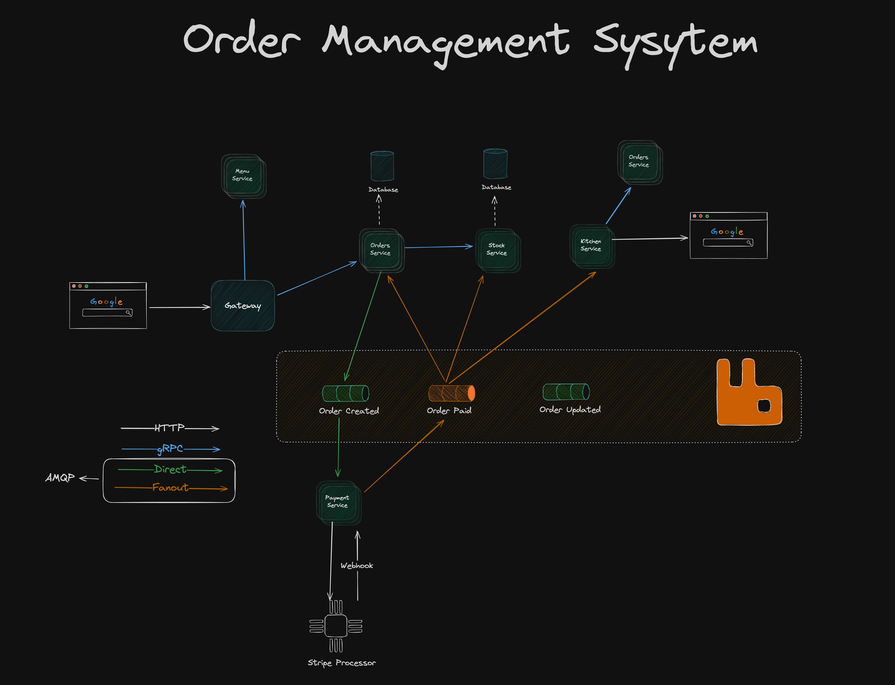

# oms-go

## Tools
- `chi` for routing
- `cosmtrek/air` for hot reload
- `gRPC` for communication between services
- `RabbitMQ` as message broker
    - Retry mechanism
- `Docker` with docker compose
- `MongoDB` as storage layer
- `Jaeger` for service tracing
- `HashiCorp's Consul` for service discovery
- `Stripe` for payments

## Architecture

## Services Breakdown
Order Service: 
- Validate order details -> talk with stock service
- CRUD of orders
- Initiates the Payment Flow -> by sending an event

Stock Service:
- Handles stock
- Validate order quantities
- (might return items as menu)

Menu Service:
- stores items as menu

Payment Service:
- Initiates a payment with a 3rd party provider
- Produces an order Paid/Cancelled event to (orders, stock and kitchen)

Kitchen Service
- Long running process of a "simulated kitchen staff"

### Pre-requisites Installation
- Docker
- golang grpc   
    - cd common && make gen - This will generate the grpc code
- air cli

## Notes
### Service Discovery
- Service discovery is a key component of a microservices architecture
- It's a mechanism that allows services to find and communicate with each other
- It also helps us to handle unresponsive services, load balancing, and failover
- 2 types of service discovery:
    - Client-side discovery
    - Server-side discovery

### Monolithic Architecture
Pros:
- Monolith architecture is more simpler which is a good thing! Specifically to deploy compared to distributed systems since we don't have to split the application into multiple parts that coordinate with each other.
- Making the codebase smaller and easier to develop and maintain. You have all the code in one repository project making it easier to understand the system as a whole and make changes across the application.
Cons:
- At a certain point the application grows so much that it becomes a bottleneck to deploy.
- Scalability: Monolithic architectures can be challenging to scale, as the entire application needs to be replicated to handle increased load.
- This is especially the case as the engineering team increases and the deploys are more frequent.

### Microservices Architecture
Pros:
- Scalability: Microservices enable better horizontal scaling, as you can scale individual services as needed.
- Fault tolerance: If one service fails, it doesn’t necessarily mean the entire application will fail.
- Smaller services: Smaller services are easier to understand, develop, and maintain.
- Decoupling: Microservices are loosely coupled, so you can update one service without affecting the others.
- Technology diversity: You can use different technologies for different services.

Cons:
- It's more resource intensive because when a system consists of multiple components, they are divided among multiple servers. They need to communicate and that communication increases the latency.
- Harder to debug
- Consistency: data is often scattered among the 
- Possible duplication of code and features
- Observability: Which because the system is made of the parts we need to collect more data, including traces, logs and other metrics.

### gRPC
- gRPC is a high-performance, open-source universal RPC framework.
- gRPC can be used to create synchronous and immediate communication between services.
- Strongly typed contracts between the services
- Protocol buffers > JSON
- Good candidate for server-to-server communication

### gRPC use cases
- Microservices: Ideal for connecting services within a microservices architecture, facilitating efficient inter-service communication. 
- Real-time applications: Suitable for applications requiring low-latency, real-time data exchange, such as streaming and IoT devices. 
- Connecting devices and browsers: Can be used to connect mobile devices, browser clients, and other devices to backend services. 
